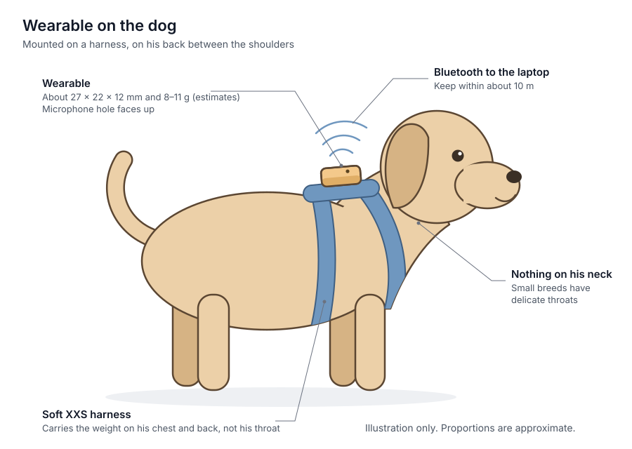
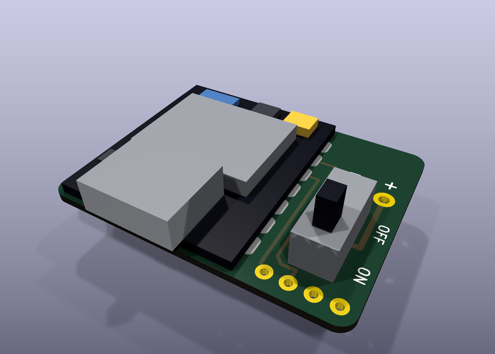
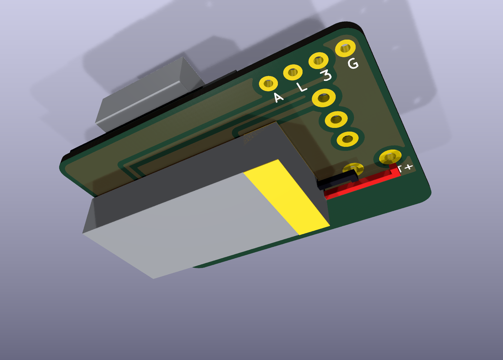
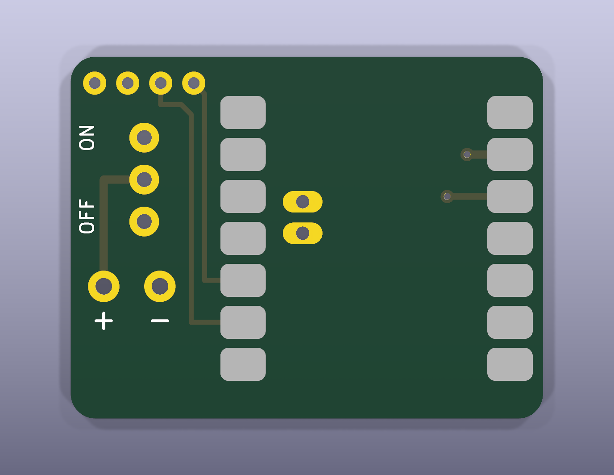
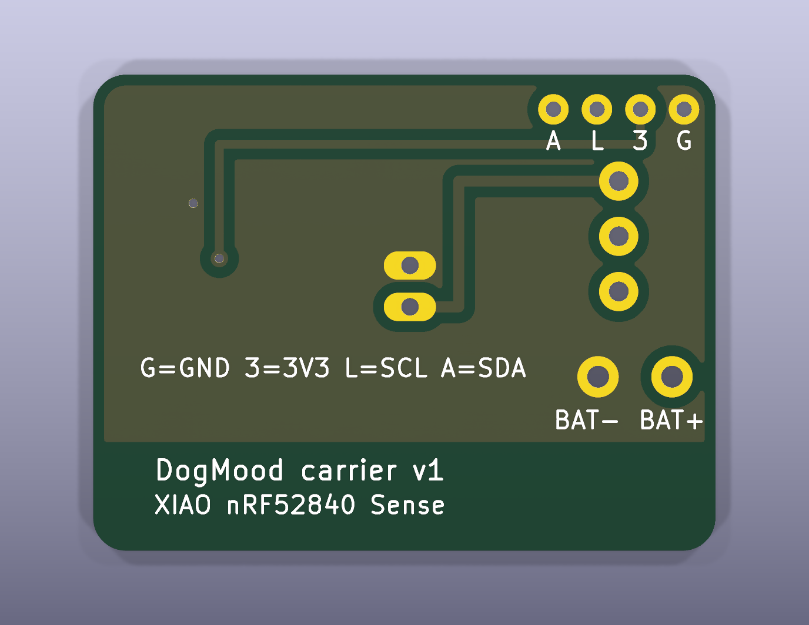

# 🐕 DIY Smart Dog Collar: Real-Time Mood Detection + AI Translation

A one-month vlog project building a wearable dog mood detector using an ESP32, a motion sensor, a microphone, and machine learning. The collar guesses your dog's mood and "says" it as a simple English phrase.

**Status:** In Development (1-Month Vlog Sprint)  
**Timeline:** October 2026  
**Deliverable:** YouTube vlog + working prototype + open-source code

---

## 🎯 Project Overview

- **Wearable hardware:** Seeed XIAO nRF52840 Sense (motion sensor, microphone, Bluetooth and charger on one 21 × 18 mm board) with a 100–150 mAh LiPo, about 8–11 g in total. See [`hardware/WEARABLE_BUILD.md`](hardware/WEARABLE_BUILD.md).
- **Bench hardware:** ESP32 + MPU6050 (motion) + INMP441 (microphone) on a breadboard, for development
- **Cage camera (recommended):** the only source of where he is. It tracks his position, outline and movement in the cage, and lets you label recordings from video afterwards. See [`docs/CAMERA.md`](docs/CAMERA.md).
- **Firmware:** Arduino C++, binary BLE packets with 50 Hz motion and a 12-band sound spectrum at 25 Hz
- **ML:** Random Forest classifier on 8-second windows of motion, sound, location, heart rate and context
- **Live:** a laptop script that runs the model and speaks the phrase, staying quiet when it is not sure
- **App:** TinyTalk, a web app that installs on a phone, connects to the collar, can use the phone as the cage camera, records labelled data and speaks the phrases. A first version; see [`app/`](app/).
- **Ground truth:** the mood you type into the data logger while watching your dog

**Mood Classes:** Playful, Sleepy, Hungry, Potty, Sad, Lonely, Anxious, Alert, Content, Stressed

The list and the phrases for each mood live in [`ml/moods.json`](ml/moods.json). Edit that one file to add, remove or reword them. Which sensor, signal and feature stands behind each phrase is in [`docs/MOODS.md`](docs/MOODS.md).




Shopping list, with Shopee and Lazada search links: [`docs/PH_SHOPPING_LIST.md`](docs/PH_SHOPPING_LIST.md).

### Carrier board (optional)

A small two-layer board the XIAO solders onto, holding the switch and battery. It passes KiCad's design rule check but has not been fabricated yet. Details, Gerbers and assembly steps are in [`hardware/pcb/`](hardware/pcb/).

Assembled, from above and below. The XIAO, switch and battery are simplified block models, so sizes are nominal and the positions of parts on the XIAO are approximate:




The bare board, top and bottom:




### Housing

A two-part printed case for the carrier-board build, with rounded edges, a USB-C opening, a switch slot and a microphone hole. It is modelled but not yet printed. Files and print settings are in [`hardware/enclosure/`](hardware/enclosure/).

These are renders of the 3D model, not photos:


### What is built and what is not

| Part | State |
|------|-------|
| ESP32 bench firmware | Written. Not yet compiled or run on hardware. |
| XIAO wearable firmware | Written. Not yet compiled or run on hardware. |
| Wearable hardware | Designed. Not yet built; weight and battery life are estimates. |
| Carrier PCB (optional) | Designed; passes KiCad's design rule check. Not yet fabricated. See [`hardware/pcb/`](hardware/pcb/). |
| Data logger | Written. Packet decoding, heart-rate decoding and CSV output tested with synthetic packets; not yet run against a real collar or strap. |
| Trainer | Written. Runs end to end on synthetic data; no real dog data yet. |
| Live prediction | Written. Tested by replaying synthetic packets; not yet run against a real collar. |
| Cage camera, unattended recording, video labelling | Written. Tested on a synthetic video; not yet run on a real camera or dog. |
| Tail, ear and posture tracking (pose model) | Not started. |
| Housing for the carrier-board build | Modelled; not yet printed. See [`hardware/enclosure/`](hardware/enclosure/). |
| Starter dataset and model | **Synthetic**, for running the scripts only; says nothing about a real dog. See [`data/starter/`](data/starter/). |
| TinyTalk web app | First version, with phone-as-camera and recording. Demo mode, the model arithmetic and the camera tracker (on made-up pictures) tested; not yet used with a real collar, cage or dog. See [`app/`](app/). |
| On-collar speaker, real dog dataset | Not started. |

---

## 📁 Repository Structure

```
dog-mood-collar-vlog/
├── firmware/
│   ├── dog_collar_xiao/              # Wearable: XIAO nRF52840 Sense
│   └── dog_collar_firmware/          # Bench prototype: ESP32 + breakouts
├── ml/
│   ├── moods.json                    # Mood classes + spoken phrases
│   ├── collar.py                     # BLE connection + packet decoding (shared)
│   ├── features.py                   # Window features (shared)
│   ├── ble_data_logger.py            # Record sensor data + label moods
│   ├── train_mood_model.py           # Train and test the classifier
│   ├── live_predict.py               # Say his mood live
│   ├── make_voice_clips.py           # Record the phrases as sound clips for the app
│   ├── export_app_model.py           # Export a trained model for the web app
│   ├── make_starter_dataset.py       # Writes the synthetic starter data
│   ├── starter_model/                # Model trained on the synthetic data
│   ├── camera.py                     # Cage camera tracker
│   ├── label_video.py                # Label a recording from its video
│   └── requirements.txt
├── hardware/
│   ├── WEARABLE_BUILD.md             # The light version he wears
│   ├── pcb/                          # Optional carrier board (KiCad, Gerbers, renders)
│   ├── enclosure/                    # Printable housing for the carrier board (STL, STEP)
│   ├── BOM.csv                       # Bench prototype bill of materials
│   └── WIRING_REFERENCE.txt          # Bench prototype connections and checks
├── data/                             # Your recordings (git-ignored)
│   └── starter/                      # Synthetic starter dataset
├── app/                              # TinyTalk web app (installable, runs the model on the phone)
└── docs/
    ├── PH_SHOPPING_LIST.md           # What to buy, and what not to
    ├── MOODS.md                      # Sensor, signal, features and phrase for each mood
    ├── CAMERA.md                     # Cage camera setup and labelling from video
    ├── images/                       # Drawings
    └── ...                           # Older checklists*
```

*\*`BUILD_CHECKLIST.md`, `TROUBLESHOOTING.md` and `FUTURE_IMPROVEMENTS.md` still describe the original four-sensor design and need updating.*

---

## 🚀 Quick Start

### 1. Hardware
**To put it on the dog,** build the wearable from [`hardware/WEARABLE_BUILD.md`](hardware/WEARABLE_BUILD.md) and skip to step 2. The steps below are for the ESP32 bench prototype, which is too heavy for a small dog.

1. Wire the breadboard from `hardware/WIRING_REFERENCE.txt`. **Read the power section first:** the battery goes on the TP4056 `B+`/`B-` pads, never `IN+`/`IN-`.
2. In Arduino IDE, install ESP32 board support and the **Adafruit MPU6050** library.
3. Flash `firmware/dog_collar_firmware/dog_collar_firmware.ino`.
4. Open the Serial Monitor at 115200 baud and run the bench checks in the wiring reference.

### 2. Data collection
```bash
pip install -r ml/requirements.txt
```
```bash
python ml/ble_data_logger.py
```
Type a mood (a unique prefix is enough, e.g. `hu` for hungry) to start labelling, `u` to pause. Also tell the logger what the sensors cannot see:

| Command | Meaning |
|---------|---------|
| `fed` | he just ate |
| `went` | he just peed or pooped |
| `away` / `home` | you are leaving him alone / you are back |

**Or record now and label later.** With a camera on his cage, the logger can record everything while you are away, and you label the video afterwards. See [`docs/CAMERA.md`](docs/CAMERA.md).

```bash
python ml/ble_data_logger.py --camera 0 --unattended
```
```bash
python ml/label_video.py
```

### 3. Training
```bash
python ml/train_mood_model.py
```
The model and its confusion matrix go to `ml/trained_models/`.

### 4. Live moods
```bash
python ml/live_predict.py
```
Every 4 seconds it prints the mood for the last 8 seconds, averaged over the last three predictions. When the model is at least 50% confident it speaks one of the phrases through the computer; otherwise it prints "not sure". The `fed`, `went`, `away` and `home` commands work here too. Add `--mute` to print without speaking.

### Optional: heart rate (larger dogs only)
A chest strap is too big and heavy for a teacup puppy; skip this section for him.

A dog's heart rate and its beat-to-beat variability change with excitement and stress, which motion and sound cannot always show. An ECG chest strap that speaks the standard Bluetooth Heart Rate profile (for example a Polar H10) can be recorded alongside the collar:

```bash
python ml/ble_data_logger.py --hr Polar
```
```bash
python ml/live_predict.py --hr Polar
```

Wet the electrodes or use electrode gel, and part the fur so they touch skin behind the front legs. Readings are most reliable while he is still. This path is untested on a real dog; check that `?` in the logger shows a plausible heart rate before recording. A model trained with the strap needs the strap at prediction time.

---

## 🏷️ Labelling moods well

Your labels are the ground truth, so the model can only be as good as they are.

- **Label when you are sure.** Pause (`u`) whenever you are not.
- **Anchor each mood to a situation you can recognise:**

| Mood | Good moments to record |
|------|------------------------|
| Playful | Play bows, bringing a toy, zoomies |
| Sleepy | Yawning, curling up, settling in his bed |
| Hungry | Before a late meal: hovering at the bowl, following you to the kitchen |
| Potty | Hours since his last break: waiting at the door, circling, sniffing |
| Sad | Low, slow, withdrawn; ignoring toys and people |
| Lonely | Alone after you leave: whining, howling, waiting by the door |
| Anxious | Pacing, panting, trembling (thunder, fireworks, the vet) |
| Alert | Frozen and focused, barking at a sound or visitor |
| Content | Relaxed while being petted or resting near you |
| Stressed | Overwhelmed: too many people, loud noise, being handled |

- **Record every mood on several separate occasions**, at least 5 and ideally 10+, each a minute or more. The trainer tests on occasions it never trained on and skips any mood with fewer than 2.
- **Lonely needs you to be gone.** Record unattended with the cage camera and label the video afterwards, or start the label, type `away`, and leave the laptop in BLE range.

---

## 📋 Hardware BOM

| Component | Model | Price* | Notes |
|-----------|-------|--------|-------|
| Microcontroller | ESP32-WROOM-32 | — | Already owned |
| IMU | MPU6050 | ₱250 | 6-axis accel + gyro, I2C |
| Microphone | INMP441 | ₱150 | I2S, barks and whines |
| LiPo Battery | 1000mAh 3.7V | ₱300 | With protection circuit |
| Charging | TP4056 with protection | ₱100 | 6-pad module |
| Regulator | HT7333 / MCP1700-3302 | ₱50 | Battery → 3.3V |
| USB-C Port | Breakout | ₱100 | Charging |
| Heart rate (optional) | Polar H10 or other BLE ECG chest strap | not priced | Connects to the laptop, not the collar |

**Total new purchases (PH):** about ₱1,850 including perfboard, filament and straps.

*\*Budget estimates. See `hardware/BOM.csv` for the full list.*

The first design also had a MAX30102 heart-rate sensor and an MLX90614 IR thermometer. Both were dropped: the MAX30102 is designed for bare human skin held still, and the MLX90614 would read the fur surface, not body temperature. Heart rate now comes from the optional chest strap instead.

An on-collar speaker is planned for later. It needs an I2S amplifier such as the MAX98357A; the PAM8403 is an analog amplifier and cannot take I2S directly.

---

## 📊 Targets

| Metric | Target | Achieved |
|--------|--------|----------|
| Accuracy on held-out sessions | Clearly above the "most common mood" baseline the trainer prints | — |
| BLE Range | >10m | — |
| Battery Life | 6–8 hrs | — |
| Accuracy when the model is confident enough to speak | Higher than the overall figure; the trainer prints both | — |
| Mood Latency | 8–16 sec (8-second window, smoothed over three predictions) | — |
| Vlog Duration | 15–20 min | — |

---

## ⚠️ Known Limitations

- **The model learns your reading of your dog.** There is no instrument that measures a dog's mood, so "accuracy" means agreement with your labels.
- **Hungry and potty lean on context.** They are predicted mostly from the time since you typed `fed` or `went`, helped by where the cage camera sees him, so they only work while you keep logging those events. Run the trainer with `--no-context` to see how far motion and sound alone get.
- **A model belongs to one device.** The ESP32 prototype and the XIAO wearable have different microphones and motion sensors. Record the training data on the device he will wear.
- **Similar moods will be confused.** Expect sad/sleepy/content and anxious/stressed/alert to blur; the confusion matrix shows which.
- **One dog.** A model trained on your dog will not transfer to another.
- **No view of his tail or ears.** They carry much of a dog's mood. The cage camera sees only his outline, position and movement; tracking body parts needs an animal pose model, which is the next step beyond this design.
- **The laptop must stay in BLE range** (about 10 m) for both recording and live prediction.
- The housing is 3D-printed and not waterproof. Do not leave the collar on an unsupervised dog, and never charge it while he is wearing it.

---

## 🎥 Vlog Narrative

**Hook (0:00–0:15):** "I built an AI collar that translates my dog's mood to English"

**Build (0:15–8:00):** Assembly, soldering montage, code walkthrough, data collection time-lapse

**Training (8:00–12:00):** Model training, feature importance, confusion matrix

**Demo (12:00–18:00):** Real-time predictions on actual dog behavior

**Closeout (18:00–20:00):** Learnings, challenges, future improvements

---

## 🤝 Contributing

This is a vlog/learning project, but if you:
- Build this and find improvements
- Adapt it for other animals
- Improve the ML model
- Add new features

Feel free to fork and share your results!

---

## 📝 License

MIT License — See LICENSE file for details

Free to use, modify, and share for personal/educational projects.

---

## 📚 References

- [MPU6050 Datasheet](https://invensense.tdk.com/wp-content/uploads/2015/02/MPU-6000-Datasheet1.pdf)
- [INMP441 Datasheet](https://invensense.tdk.com/wp-content/uploads/2015/02/INMP441.pdf)
- [Random Forest Classifier](https://scikit-learn.org/stable/modules/generated/sklearn.ensemble.RandomForestClassifier.html)
- [StratifiedGroupKFold](https://scikit-learn.org/stable/modules/generated/sklearn.model_selection.StratifiedGroupKFold.html)
- [Bleak (Python BLE)](https://bleak.readthedocs.io/)

---

## 👤 Author

Built by **Jaz Villanueva** (DLSU Computer Engineering)

---

**Last Updated:** October 2026 | **Status:** 🚀 In Progress
