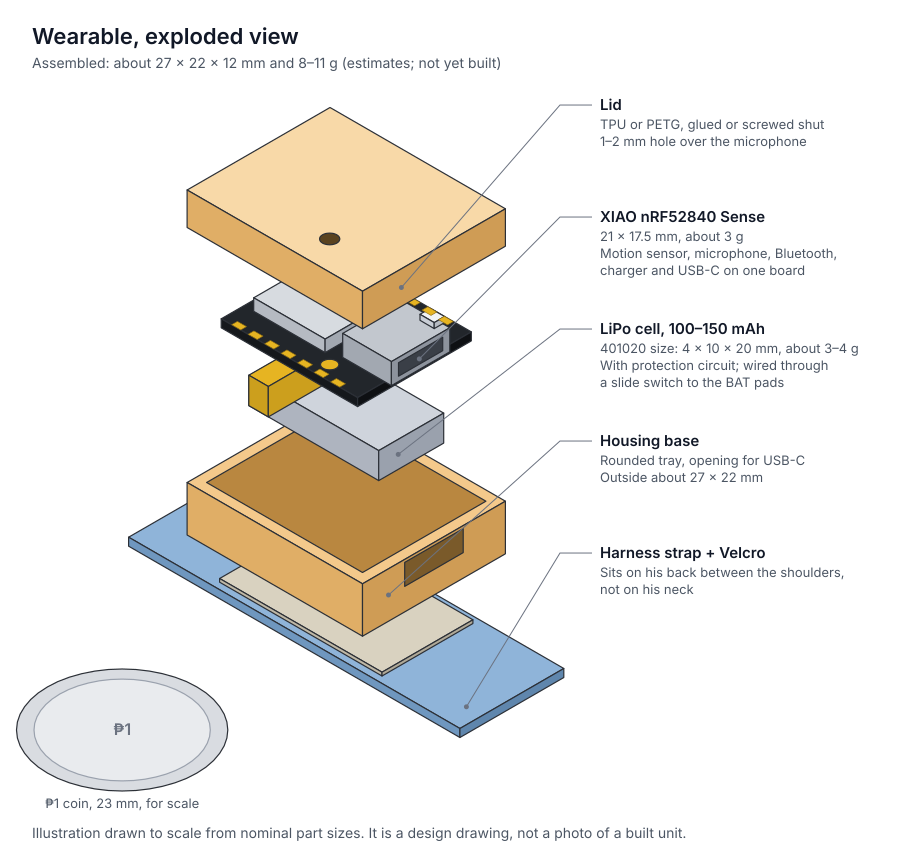

# Shopping List (Philippines)

Two lists: the **wearable** he actually wears, and the optional **bench prototype** for development on the ESP32 you already own. If you only buy one thing, buy the XIAO nRF52840 **Sense**.

Prices were looked up on 2026-10-01 where a source is given. Everything marked *estimate* is a rough budget figure that was not checked against a live listing. Check stock and price before ordering.

## 1. Wearable (required)

| # | Item | What to look for | Qty | Price | Where |
|---|------|------------------|-----|-------|-------|
| 1 | **Seeed Studio XIAO nRF52840 Sense** | The name must include **Sense**. Buy the version **without** pre-soldered header pins: pins add weight and height. | 1 | US$16.90 listed by Seeed [1]; expect roughly ₱1,500–2,000 locally (*estimate*) | Seeed Studio [1], or search "XIAO nRF52840 Sense" on Shopee / Lazada |
| 2 | LiPo cell, 3.7 V, 100–150 mAh, **with protection circuit** | Size code 401020 (4 × 10 × 20 mm) or 501225. Listing should say "with PCM" or "protected". Bare wire leads are fine. | 2 | ₱100–200 each (*estimate*) | Shopee: "3.7V 150mAh lipo 401020" |
| 3 | Sub-miniature slide switch | SPDT, about 7 × 3 mm | 2 | ₱5–20 each (*estimate*) | Shopee: "mini slide switch SS12D00" |
| 4 | Thin stranded wire, 30 AWG silicone | A short length, two colours | 1 | ₱50–100 (*estimate*) | Shopee: "30AWG silicone wire" |
| 5 | Kapton (polyimide) tape | To insulate the battery joints | 1 | ₱50–100 (*estimate*) | Shopee: "kapton tape 10mm" |
| 6 | TPU or PETG filament | For the housing; TPU is softer against him | small amount | ₱150–250 if you need a spool (*estimate*) | Lazada / Shopee, or a makerspace |
| 7 | **Puppy harness, XXS** | Soft mesh step-in type, adjustable. He will outgrow it. | 1 | ₱150–300 (*estimate*) | Pet shop, so you can fit it on him |
| 8 | Sew-on Velcro, 16–20 mm wide | To fix the housing to the harness | 1 | ₱50–100 (*estimate*) | Shopee / craft shop |
| 9 | USB-C data cable | For flashing and charging; many cables are charge-only | 1 | probably owned | — |

**Optional carrier board:** if you build the version in [`hardware/pcb/`](../hardware/pcb/), also order the boards (two layers, 0.8 mm; price depends on the maker and shipping, not checked) and buy an **SS12D00G3** slide switch in place of item 3.

**Wearable total:** about ₱2,200–3,300 (*estimate*), most of it the XIAO.

> **Careful with local listings.** Makerlab lists a "Seeed Studio XIAO nRF52840" at ₱1,500 [2]. That is the plain board, with **no motion sensor and no microphone**, and it showed as out of stock on 2026-10-01. It will not work for this project.

Buy a second battery and switch. They are cheap, and the solder pads are small enough that a spare is worth having.

## 2. Location beacons (recommended)

They tell the model whether he is at his bowl, the door or his bed, which is the best evidence for hungry, potty and sleepy.

| Item | What to look for | Qty | Price | Where |
|------|------------------|-----|-------|-------|
| Any ESP32 board | The ESP32-WROOM you already own works as one. "ESP32-C3 Super Mini" boards are the cheapest. | 3 (buy 2) | ₱150–300 each (*estimate*) | Shopee: "ESP32 C3 super mini" |
| USB phone charger + cable | One per beacon | 3 | probably owned | — |

## 3. Cage camera (optional)

It adds his position, outline and movement in the cage, and lets you label recordings from video. Setup is in [`CAMERA.md`](CAMERA.md).

| Item | What to look for | Qty | Price | Where |
|------|------------------|-----|-------|-------|
| Camera | Either a USB webcam, or a Wi-Fi camera that offers a local **RTSP** stream (many cloud-only cameras do not). Infrared night vision if you want to see him in the dark. | 1 | ₱500–1,500 (*estimate*) | Shopee / Lazada: "USB webcam 1080p" or "IP camera RTSP" |
| Mount or clamp | Must hold the camera rigidly above the cage | 1 | ₱100–300 (*estimate*) | Shopee: "webcam clamp mount" |
| Bedding in a colour unlike his coat | The tracker needs contrast to see him | 1 | probably owned | — |

## 4. Bench prototype (optional)

Only if you want to develop on the ESP32 before the XIAO arrives. This build is too heavy for him to wear. The full list with quantities is in [`hardware/BOM.csv`](../hardware/BOM.csv).

| Item | Qty | Price (*estimate*) |
|------|-----|--------------------|
| MPU6050 motion sensor module | 1 | ₱250 |
| INMP441 I2S microphone module | 1 | ₱150 |
| LiPo 1000 mAh with protection | 1 | ₱300 |
| TP4056 charger module with protection (6 pads) | 1 | ₱100 |
| HT7333 or MCP1700-3302 regulator | 2 | ₱50 |

## Shopee and Lazada search links

These open a **search**, not a single listing. Individual listings change seller, price and stock too often to pin, and none of the results were checked. Read the "what to look for" column above against the listing before buying.

| Item | Shopee | Lazada | Check |
|------|--------|--------|-------|
| XIAO nRF52840 **Sense** (no header pins) | [Shopee](https://shopee.ph/search?keyword=xiao%20nrf52840%20sense) | [Lazada](https://www.lazada.com.ph/catalog/?q=xiao+nrf52840+sense) | The plain "XIAO nRF52840" has no motion sensor or microphone |
| LiPo 3.7 V 100–150 mAh, protected | [Shopee](https://shopee.ph/search?keyword=3.7V%20150mAh%20lipo%20401020) | [Lazada](https://www.lazada.com.ph/catalog/?q=3.7V+150mAh+lipo+401020) | Must say PCM or protected |
| Slide switch SS12D00G3 | [Shopee](https://shopee.ph/search?keyword=SS12D00G3%20slide%20switch) | [Lazada](https://www.lazada.com.ph/catalog/?q=SS12D00G3+slide+switch) | 3 pins in a row, 2.5 mm apart, 3 mm lever |
| 30 AWG silicone wire | [Shopee](https://shopee.ph/search?keyword=30AWG%20silicone%20wire) | [Lazada](https://www.lazada.com.ph/catalog/?q=30AWG+silicone+wire) | Two colours |
| Kapton tape, 10 mm | [Shopee](https://shopee.ph/search?keyword=kapton%20tape%2010mm) | [Lazada](https://www.lazada.com.ph/catalog/?q=kapton+tape+10mm) |  |
| TPU filament 1.75 mm | [Shopee](https://shopee.ph/search?keyword=TPU%20filament%201.75mm) | [Lazada](https://www.lazada.com.ph/catalog/?q=TPU+filament+1.75mm) | Or PETG |
| Puppy harness, XXS | [Shopee](https://shopee.ph/search?keyword=puppy%20harness%20XXS%20mesh) | [Lazada](https://www.lazada.com.ph/catalog/?q=puppy+harness+XXS+mesh) | Better fitted on him in a pet shop |
| Sew-on Velcro, 20 mm | [Shopee](https://shopee.ph/search?keyword=sew%20on%20velcro%2020mm) | [Lazada](https://www.lazada.com.ph/catalog/?q=sew+on+velcro+20mm) |  |
| ESP32-C3 Super Mini (beacons) | [Shopee](https://shopee.ph/search?keyword=ESP32%20C3%20super%20mini) | [Lazada](https://www.lazada.com.ph/catalog/?q=ESP32+C3+super+mini) | Buy 2–3 |
| USB webcam 1080p (cage camera) | [Shopee](https://shopee.ph/search?keyword=USB%20webcam%201080p) | [Lazada](https://www.lazada.com.ph/catalog/?q=USB+webcam+1080p) | Optional |
| IP camera with RTSP (cage camera) | [Shopee](https://shopee.ph/search?keyword=IP%20camera%20RTSP) | [Lazada](https://www.lazada.com.ph/catalog/?q=IP+camera+RTSP) | Optional; check the listing says RTSP |
| MPU6050 module (bench only) | [Shopee](https://shopee.ph/search?keyword=MPU6050%20module) | [Lazada](https://www.lazada.com.ph/catalog/?q=MPU6050+module) | Optional |
| INMP441 microphone (bench only) | [Shopee](https://shopee.ph/search?keyword=INMP441%20I2S%20microphone) | [Lazada](https://www.lazada.com.ph/catalog/?q=INMP441+I2S+microphone) | Optional |
| TP4056 with protection (bench only) | [Shopee](https://shopee.ph/search?keyword=TP4056%20type-c%20protection) | [Lazada](https://www.lazada.com.ph/catalog/?q=TP4056+type-c+protection) | Optional; 6-pad version |
| HT7333 regulator (bench only) | [Shopee](https://shopee.ph/search?keyword=HT7333) | [Lazada](https://www.lazada.com.ph/catalog/?q=HT7333) | Optional |

The carrier boards are ordered from a board maker, not from Shopee or Lazada: upload [`hardware/pcb/gerbers/`](../hardware/pcb/gerbers/) as a zip to [JLCPCB](https://jlcpcb.com/) or [PCBWay](https://www.pcbway.com/).

## Do not buy

Earlier versions of this project listed these. They do not work for a small dog, or are not good for him.

| Item | Why not |
|------|---------|
| MAX30102 heart-rate sensor | Optical; does not read through fur |
| MLX90614 IR thermometer | Reads the fur surface, not body temperature |
| HC-SR04 ultrasonic sensor | Emits 40 kHz sound that dogs can hear, next to his ears |
| VL53L0X distance sensor | Adds no mood information |
| PAM8403 amplifier and speaker | Extra weight and loud sound at his head; the laptop speaks instead |
| 1000 mAh battery for the wearable | About 20 g, heavier than the whole wearable |
| A custom board with its own radio chip | Not lighter than the XIAO, and far riskier. The optional carrier board in [`hardware/pcb/`](../hardware/pcb/) is the sensible version. |

## Tools

Fine-tip soldering iron, thin solder, flush cutters, and a multimeter to check the battery polarity before soldering it to the board. Access to a 3D printer for the housing; the files are in [`hardware/enclosure/`](../hardware/enclosure/).

## References

1. Seeed Studio, "Seeed Studio XIAO nRF52840 Sense (Pre-Soldered)" product page, price and specifications as shown in search results on 2026-10-01. https://www.seeedstudio.com/Seeed-Studio-XIAO-nRF52840-Sense-Pre-Soldered-p-6330.html (This link is the pre-soldered variant; choose the version without headers.)
2. Makerlab Electronics, "Seeed Studio XIAO nRF52840" product page, ₱1,500 and out of stock as shown in search results on 2026-10-01. https://makerlab.ph/products/seeed-studio-xiao-nrf52840
3. RobotShop, "Seeed Studio XIAO nRF52840 Sense" product page, 21 × 17.5 mm board size, retrieved 2026-10-01. https://www.robotshop.com/products/seeedstudio-seeed-studio-xiao-nrf52840-sense-tinyml-tensorflow-lite-imu-microphone-bluetooth-50
