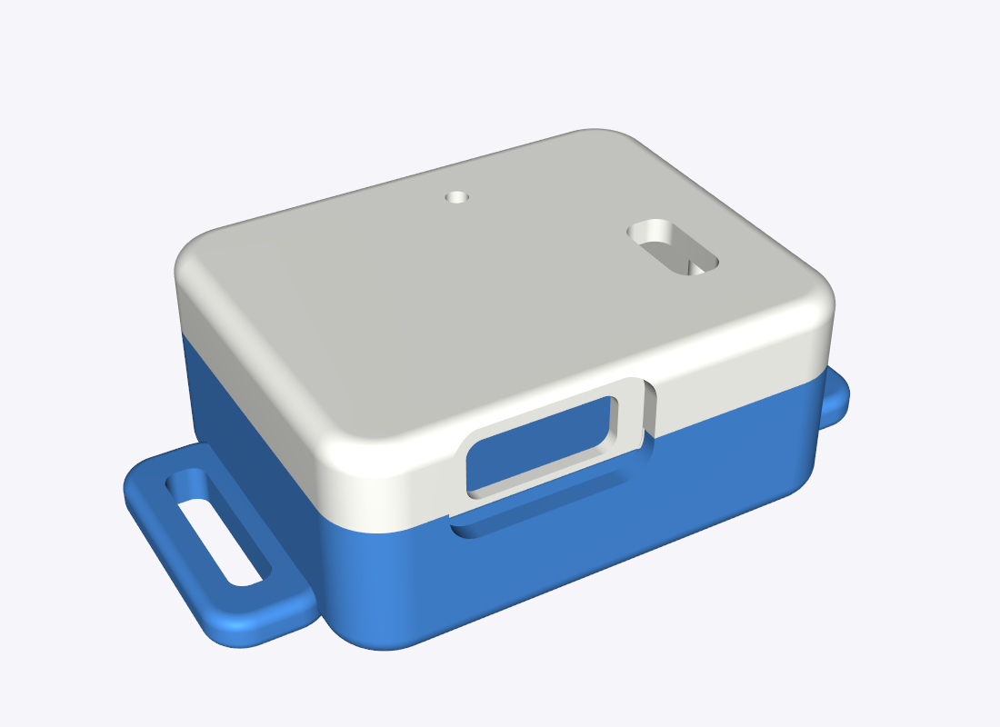
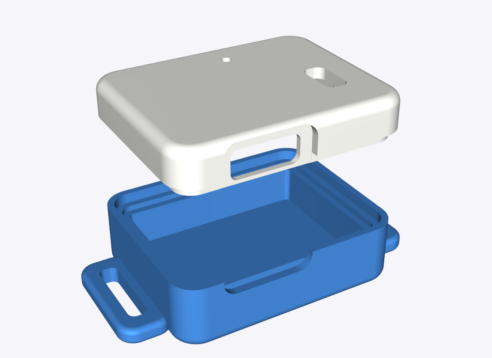

# Housing for the Carrier-Board Build

A two-part printed case for the carrier board in [`../pcb/`](../pcb/) with the XIAO, switch and battery fitted. All outside edges are rounded.




Renders of the 3D model, not photos.

**Status:** modelled and checked in software against block models of the parts. **Not yet printed.** Expect to adjust a value or two after the first print.

## Files

| File | What it is |
|------|------------|
| `base.stl` | Bottom half, flat underneath for sew-on Velcro |
| `base_strap.stl` | Same, with two slots for a 10 mm harness strap |
| `lid.stl` | Top half, already turned roof-down for printing |
| `enclosure.step` | Both halves assembled, for editing in CAD |
| `generate_enclosure.py` | The source; every dimension is a named value |

Print one base and the lid.

## Dimensions

| | mm |
|---|---|
| Outside, without strap slots | 33.1 × 26.4 × 14.4 |
| Outside, with strap slots | 45.1 × 26.4 × 14.4 |
| Walls / floor and roof | 2.0 / 1.6 |
| Corner radius, seen from above | 3.75 |
| Top and bottom edge radius | 1.5 |
| Board pocket | 29.1 × 22.4 (board 28.6 × 21.9 plus 0.25 all round) |
| Space under the board | 5.4 (4.2 battery + 1.2 for solder joints and tape) |
| Space above the board | 5.0 |
| Strap slots | 11.5 × 2.6 |
| Printed volume | about 5.4 cm³ (5.7 with strap slots); roughly 6–7 g in PETG or TPU at full density |

Exact, from the board's own design file: the board outline, and so the pocket.

Nominal, from typical part figures: the heights of the XIAO, USB-C connector, switch and battery, and the microphone position. These are marked `NOMINAL` in the script.

## Features

- **Board shelf.** The board rests on a 1 mm shelf all round, with the battery in the pocket beneath.
- **Overlapping joint.** The lid's tongue drops 1.5 mm inside the base's rim, with 0.15 mm of play.
- **Two posts** in the lid hold the board down on its bare left side.
- **USB-C opening** in the end wall, with a recess so the cable's plug seats fully.
- **Switch slot** in the roof. The lever of an SS12D00G3 (3 mm lever) ends about level with the roof, so move it with a fingernail. A longer lever will stick out.
- **Microphone hole,** 1.5 mm, in the roof.

## Printing

| Setting | Value |
|---------|-------|
| Material | TPU for softness, or PETG |
| Layer height | 0.15–0.2 mm |
| Orientation | As exported: base floor-down, lid roof-down |
| Supports | None for the base and lid. The rounded bottom edge may print slightly rough. |
| Infill | 100% (the parts are nearly all wall) |

## Assembly

1. Stick Kapton tape over the solder joints on the back of the board.
2. Lay the battery in the base pocket and lower the board onto the shelf, USB toward the notched end.
3. Put a small piece of soft foam on the XIAO's metal shield so the lid presses the right side of the board down.
4. Glue a scrap of thin fabric inside the lid over the microphone hole.
5. Check the lid closes, the switch moves, and a USB-C cable plugs in fully.
6. Glue the lid on with a few small drops, so it can still be cut open.

## Checks on the first print

- [ ] The board drops into the pocket without force and does not rattle.
- [ ] The lid closes fully; nothing touches the roof.
- [ ] The switch lever moves end to end in its slot.
- [ ] A USB-C cable clicks in and the board charges.
- [ ] The base does not bulge: the battery is not squeezed.

| If | Change in `generate_enclosure.py` |
|----|-----------------------------------|
| Board too tight or loose | `CLEARANCE` |
| Lid too tight or loose | `JOINT_GAP` |
| Lid will not close | `TOP_CLEARANCE` |
| Battery squeezed, or using a 501225 cell | `BATTERY_THICKNESS` (5.2 for a 501225) |
| Cable does not seat | `PLUG_WIDTH`, `PLUG_HEIGHT`, `PLUG_RECESS` |
| Different strap | `STRAP_WIDTH` |

## Regenerating

```bash
pip install cadquery
```
```bash
python generate_enclosure.py
```

The script prints each part's size and confirms that neither half overlaps the block models of the board, XIAO, USB-C connector, switch or battery.

## Not covered

- **The hand-wired build without the carrier board.** It has no fixed layout to design a case around.
- **Beacon cases.** They depend on which ESP32 board you buy.
- **Waterproofing.** The USB opening, switch slot and microphone hole are open.

The safety rules in [`../WEARABLE_BUILD.md`](../WEARABLE_BUILD.md) still apply: supervised wear only, and never charge it on the dog.
